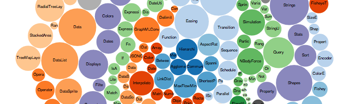
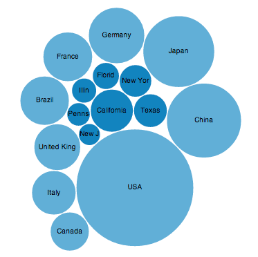



The Bubble Chart Widget transforms an ordinary HTML table into a
<a href="http://d3js.org/">D3-powered</a> bubble chart.

<a href="example.html">View the completed example</a>

## 1. Link to the library

Add the CTS library, D3 library, and widget link to your web page:

    
    
    

It's best to add this to the `HEAD` element, but anywhere will work.

## 2. Write your Chart Data

Next, pick the place you want the map to actually appear on your page and paste
in the following HTML: 

    

      <ul class="bubblechains">
        <li>
          States
          <table>
            <tr><td>California</td><td>1911822</td></tr>
            <tr><td>Texas</td><td>1158194</td></tr>
            <tr><td>New York</td><td>1078161</td></tr>
            <tr><td>Florida</td><td>734727</td></tr>
          </table>
        </li>
        <li>
          Countries
          <table>
            <tr><td>USA</td><td>14620000</td></tr>
            <tr><td>China</td><td>5879100</td></tr>
            <tr><td>Japan</td><td>5391000</td></tr>
            <tr><td>Germany</td><td>3306000</td></tr>
          </table>
        </li>
      </ul>
     

The `bubblechart` class tells the chart widget that you'd like that table
turned into a bubble chart. When you render your page, you should see the
following (we've added a few more data points):

In the example's case, this is the Gross Domestic Product for several states in
America.

## 3. Customize the Chart

TODO

### Credits

Thanks to the [Bubble Chart Demo](http://mbostock.github.com/d3/ex/bubble.html)
on the D3 website.

