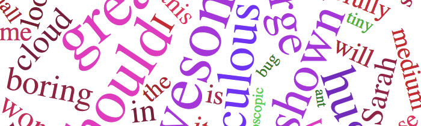



The Word Cloud Widget helps you turn text into a wordcloud.

<a href="example.html">View the completed example</a>

## 1. Link to the library

Add the CTS library, D3 library, and widget link to your web page:

    
    
    
    

These should be added to the `HEAD` element if possible.

## 2. Write some text to turn into a word cloud.

The Word Cloud works manually: you tell it what words you want to be big,
small, and medium sized and what color you want each size bucket to be.

    

      

        
reds

        

          All these words will be medium sized.
        

      

    

The color scheme can be `greens`, `reds`, `blues`, `purples`, `yellows` or
omitted completely, in which case we'll default to a primary-color based
scheme.

## 3. That's it!

When you render the page, you'll your text appear as a word cloud. See the
[example page](example.html) for a more involved example with small, medium,
and large buckets.

### Credits

Sarah Scodel, with thanks to the [D3 Word Cloud Demo](http://www.jasondavies.com/wordcloud).

