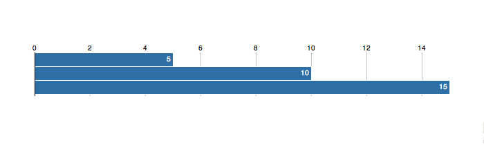
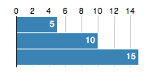



The Bar Chart Widget transforms an ordinary HTML table into a
<a href="http://d3js.org/">D3-powered</a> bar chart.

<a href="example.html">View the completed example</a>

All of this text will become the wordcloud source.

## 1. Link to the library

Add the CTS library, D3 library, and widget link to your web page:

    
    
    

It's best to add this to the `HEAD` element, but anywhere will work.

## 2. Write your Chart Data

Next, pick the place you want the map to actually appear on your page and paste
in the following HTML: 

    

       <table class="series">
         <tr>
           <td>Values</td>
           <td>5</td>
           <td>10</td>
           <td>15</td>
         </tr>
       </table>
     

The `barchart` class tells the chart widget that you'd like that table turned
into a chart. When you render your page, you should see the following:

## 3. Customize the Chart

TODO

### Credits

Thanks to the [Bar Chart
Demo](http://mbostock.github.com/d3/tutorial/bar-1.html) on the D3 website 

