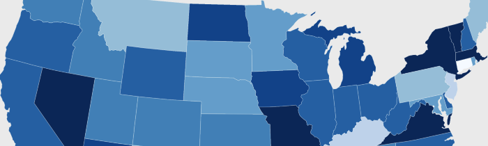
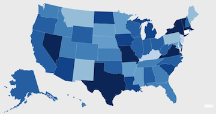



The Choropleth Widget helps you make a shaded map of the USA.

<a href="example.html">View the completed example</a>

## 1. Link to the library

Add the CTS library, D3 library, and widget link to your web page:

    
    
    
    <link rel="stylesheet" href="http://www.treesheets.org/widgets/choropleth/choropleth.css" type="text/css" media="screen" />

These must be added to the `HEAD` element.

## 2. Write your Chart Data

Next, pick the place you want the map to actually appear on your page and paste
in the following HTML. This long because we have to list one line for each of
the 50 states.

    

      <ul class="properties">
        <li class="width">600</li>
      </ul>
    
      <table class="states">
        <tr><td>Alabama</td><td>1.0</td><td></td>
        <tr><td>Alaska</td><td>1.0</td><td></td>
        <tr><td>Arizona</td><td>1.0</td><td></td>
        <tr><td>Arkansas</td><td>1.0</td><td></td>
        <tr><td>California</td><td>1.0</td><td></td>
        <tr><td>Colorado</td><td>1.0</td><td></td>
        <tr><td>Conneticut</td><td>1.0</td><td></td>
        <tr><td>Delaware</td><td>1.0</td><td></td>
        <tr><td>Florida</td><td>1.0</td><td></td>
        <tr><td>Georgia</td><td>1.0</td><td></td>
        <tr><td>Hawaii</td><td>1.0</td><td></td>
        <tr><td>Idaho</td><td>1.0</td><td></td>
        <tr><td>Illinois</td><td>1.0</td><td></td>
        <tr><td>Indiana</td><td>1.0</td><td></td>
        <tr><td>Iowa</td><td>1.0</td><td></td>
        <tr><td>Kansas</td><td>1.0</td><td></td>
        <tr><td>Kentucky</td><td>1.0</td><td></td>
        <tr><td>Louisianna</td><td>1.0</td><td></td>
        <tr><td>Maine</td><td>1.0</td><td></td>
        <tr><td>Maryland</td><td>1.0</td><td></td>
        <tr><td>Massachusetts</td><td>1.0</td><td></td>
        <tr><td>Michigan</td><td>1.0</td><td></td>
        <tr><td>Minnesota</td><td>1.0</td><td></td>
        <tr><td>Mississippi</td><td>1.0</td><td></td>
        <tr><td>Missouri</td><td>1.0</td><td></td>
        <tr><td>Montana</td><td>1.0</td><td></td>
        <tr><td>Nebraska</td><td>1.0</td><td></td>
        <tr><td>Nevada</td><td>1.0</td><td></td>
        <tr><td>New Hampshire</td><td>1.0</td><td></td>
        <tr><td>New Jersey</td><td>1.0</td><td></td>
        <tr><td>New Mexico</td><td>1.0</td><td></td>
        <tr><td>New York</td><td>1.0</td><td></td>
        <tr><td>North Carolina</td><td>1.0</td><td></td>
        <tr><td>North Dakota</td><td>1.0</td><td></td>
        <tr><td>Ohio</td><td>1.0</td><td></td>
        <tr><td>Oklahoma</td><td>1.0</td><td></td>
        <tr><td>Oregon</td><td>1.0</td><td></td>
        <tr><td>Pennsylvania</td><td>1.0</td><td></td>
        <tr><td>Rhode Island</td><td>1.0</td><td></td>
        <tr><td>South Carolina</td><td>1.0</td><td></td>
        <tr><td>South Dakota</td><td>1.0</td><td></td>
        <tr><td>Tennessee</td><td>1.0</td><td></td>
        <tr><td>Texas</td><td>1.0</td><td></td>
        <tr><td>Utah</td><td>1.0</td><td></td>
        <tr><td>Vermont</td><td>1.0</td><td></td>
        <tr><td>Virginia</td><td>1.0</td><td></td>
        <tr><td>Washington</td><td>1.0</td><td></td>
        <tr><td>West Virginia</td><td>1.0</td><td></td>
        <tr><td>Wisconsin</td><td>1.0</td><td></td>
        <tr><td>Wyoming</td><td>1.0</td><td></td>
      </table>
    

The `usa-choropleth` class tells the widget that you'd like that table turned
into a shaded map. When you render your page, you should see something like the
following:

In the example, we've put in the Gross Domestic Product for each state in
America.

### Credits

Thanks to the [Choropleth
Demo](http://mbostock.github.com/d3/ex/choropleth.html) on the D3 website and
Sarah Scodel for making the CTS widget.

