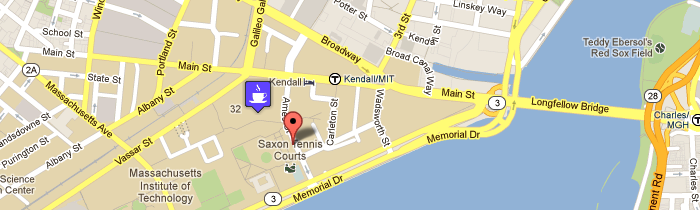



The Google Map Widget helps you
include a Google Map on your website with markers,
custom images, and popup balloons. All you need to do is
copy, paste, and edit a few lines of HTML.

<a href="example.html">View the completed example</a>

## 1. Link to the library

Add the CTS library, Google Maps library, and widget link to your web page:

    
    
    

It's best to add this to the `HEAD` element, but anywhere will work.

## 2. Request a Map

Next, pick the place you want the map to actually appear on your page and paste
in the following HTML: 

    <section class="map">

      <ul class="properties">
        <li class="center-lat">42.361335</li>
        <li class="center-lng">-71.089482</li>
        <li class="zoom-level">15</li>
        <li class="width">700px</li>
        <li class="height">500px</li>
      </ul>

    </section>

This tells the map widget that you'd like a map there. Now edit that data to
customize your particular preferences:

* The center of the map
* The zoom level (1 is zoomed far out and 17 is zoomed all the way in)
* The size of the map on your web page

## 3. Add markers to the map

If you want to add markers in your map, paste the following HTML after the
`</ul>` tag and *before* the `</section>` tag at the end:

    <table class="markers">
    
      <tr>
        <td class="title">The Stata Center</td>
        <td class="lat">42.361335</td>
        <td class="lng">-71.089482</td>
      </tr>

      <tr>
        <td class="title">Media Lab</td>
        <td class="lat">42.360859</td>
        <td class="lng">-71.08592</td>
      </tr>

    </table>

This example shows two markers being created. You can edit, delete, or add pins
by copying and pasting the HTML surrounded by `<tr>...</tr>`. 

At this point, you've created a map with pins like the one below!

## 4. Customize your Map: Add Popup Balloons

To add a popup baloon to your map, just add another
line to each marker containing a description, like this:

      <tr>
        <td class="title">The Stata Center</td>
        <td class="lat">42.361335</td>
        <td class="lng">-71.089482</td>
        <td class="description">
          Designed by Frank Ghery, the Stata Center is home to
          the Computer Science and Artificial Intelligence Laboratory
          at MIT.
        </td>
      </tr>

You can put any HTML you want inside the description. In
the example above we've just used plain text. When the
user clicks on the Stata Center pin now, they will see
this:

## 5. Customize your Map: Add Special Markers

If you don't like the basic pin image for your markers, you can add other
images instead. All you need to know is the URL of the image.  For example, if
I want to show people that there is a coffee shop inside the stata center, I
can add the following line:

      <tr>
        <td class="title">The Stata Center</td>
        <td class="lat">42.361335</td>
        <td class="lng">-71.089482</td>
        <td class="marker">http://treesheets.org/hotlink/coffee.png</td>
      </tr>

